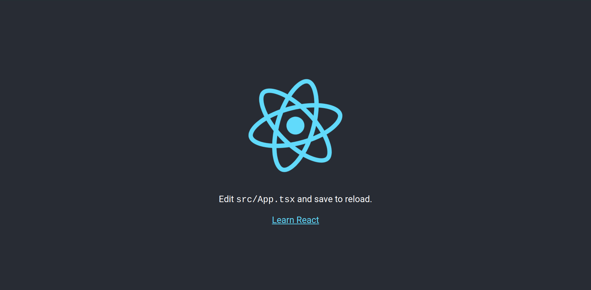

### React + TS + Styled Components

---
@transition[none]
@title[Prerequisites]

### Prerequisites

- [NPM](https://docs.npmjs.com/downloading-and-installing-node-js-and-npm)
- Code editor :) [VSCode](https://code.visualstudio.com/) is recommended
- Basic understanding of JavaScript & CSS

---
@title[Getting started]

### Getting started

1. open terminal
2. run the following commands

```bash
npm install -g create-react-app
npx create-react-app react+ts+styled --typescript
```

---
@title[Folder]

### What is in the folder?

```
.
├── package.json
├── public
│   ├── index.html
│   └── ...
├── README.md
├── src
│   ├── App.css
│   ├── App.tsx
│   ├── index.css
│   ├── index.tsx
│   └── ...
├── tsconfig.json
└── yarn.lock
```

---
@title[File extensions]

### What are the different files?

- *package.json*: dependencies of the project
- *public/index.html*: html file served
- *src/&ast;.css*: CSS files with default theme
- *src/&ast;.tsx*: TypeScript files that contain TSX
- *tsconfig.json*: configuration of TypeScript compiler

---
@transition[none]
@title[index.tsx]

### `index.tsx`

```TypeScript
import React from 'react';
import ReactDOM from 'react-dom';
import './index.css';
import App from './App';
import * as serviceWorker from './serviceWorker';

ReactDOM.render(<App />, document.getElementById('root'));

serviceWorker.unregister();
```

@snap[south span-100 text-08]
@[1, 2, zoom-17](Importing React)
@[3, zoom-16](Import css for the page)
@[4, zoom-16](Import component from file `./App`)
@[7, zoom-10](Mount the `App` component to the HTML element with id `root`. This is where React becomes visible)
@snapend

---
@transition[none]
@title[app.tsx]

### `App.tsx`

```jsx
import React, { Component } from 'react';
import logo from './logo.svg';
import './App.css';

class App extends Component {
  render() {
    return (
      <div className="App">
        <header className="App-header">
          
          <p>
            Edit <code>src/App.tsx</code> and save to reload.
          </p>
          <a
            className="App-link"
            href="https://reactjs.org"
            target="_blank"
            rel="noopener noreferrer"
          >
            Learn React
          </a>
        </header>
      </div>
    );
  }
}

export default App;
```

@snap[south span-100 text-08]
@[1-3, zoom-14](Importing React, a svg file and the css needed)
@[5, zoom-14](Defines a new React component called App)
@[6, zoom-14](Defines a function that is called by React when rendering the component)
@[8-23](This defines what is actually rendered. This is not HTML but [JSX](https://reactjs.org/docs/introducing-jsx.html))
@[28, zoom-17](!!! This line is needed so that `index.tsx` can import this component)
@snapend

---
@title[What does it show?]



---
@title[Styled Components]

### Styled Components

- CSS-in-JS
- Declare styled React components without classes

@snap[south span-100 text-08]
[Styled Components Documentation](https://www.styled-components.com/)
@snapend

+++
@title[Example]

### Example

```jsx
const JButton = styled.a`
  border-radius: 3px;
  border-color: red;
  background: transparent;
`

render(
  <div>
    <JButton as={Link} href="/docs" prefetch>
      Documentation
    </JButton>
  </div>
)
```

+++
@title[Integrating Styled Components]

### Integrating Styled Components

```
npm install --save styled-components
npm install --save @types/styled-components

```

@snap[south span-100 text-08]
@[1, zoom-13](Add styled-components as a dependency)
@[2, zoom-13](Install type declarations for TypeScript)
@snapend

---
@title[Applying Styled Components]

### Applying Styled Components

1. create a new folder inside `src` called `styles`
2. create a 2 new files inside `styles`
  - `global.ts`
  - `components.ts`

+++
@title[`global.ts`]

### `global.ts`

This contains the global styles for React (replaces `index.css`)

```JavaScript
import { createGlobalStyle } from "styled-components";

export const GlobalStyled = createGlobalStyle`
body {
  background: red;
}
`;
```

@snap[south span-100 text-08]
@[1, zoom-11](Import `createGlobalStyle` function)
@[3-7, zoom-13](Creates and exports a component called `GlobalStyled`)
@snapend


+++
@title[Use global style]

### Using Global Style

```jsx
/// other imports
import { GlobalStyled } from "./styles/global";

class App extends Component {
  render() {
    return (
      <div className="App">
        <GlobalStyled/>
        <header className="App-header">
          ...
        </header>
      </div>
    );
  }
}
```

@snap[south span-100 text-08]
@[2, zoom-13](Import the component we created before)
@[6-13, zoom-11](This will inject the global styles)
@snapend

+++
@title[`components.ts`]

### `components.ts`

This contains the components we'll write

```jsx
import styled from "styled-components";

export const AppWrapper = styled.div`
  text-align: center;
`;
```

@snap[south span-100 text-08]
@[3-5, zoom-13](This declares a div with css `text-align: center;`)
@snapend

+++
@title[Use component]

### Using components

```jsx
/// other imports
import { AppWrapper } from "./styles/components";

class App extends Component {
  render() {
    return (
      <AppWrapper>
        <GlobalStyled/>
        <header className="App-header">
          ...
        </header>
      </AppWrapper>
    );
  }
}
```

@snap[south span-100 text-08]
@[2, zoom-11](Import the component)
@[7-12, zoom-11](Use components like this)
@snapend


---
@title[Tasks]

### Tasks

1. move all of the CSS over from `index.css` to global styles
2. declare styled components for all of the JSX items (you can find the css in `App.css`)
  - `AppHeader`
  - `AppLogo`
  - `AppLink`


---
@title[What else to do?]

### Other stuff to look into

- [Styled Components Documentation](https://www.styled-components.com/)
- [React Tutorial](https://reactjs.org/tutorial/tutorial.html)
- [Our Repo](https://github.com/techclubjacobs/app)